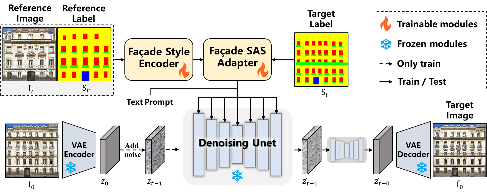

# FaçadeDiffusion

> **FaçadeDiffusion**: Building Façade Generation via Diffusion Models with Soft Semantic Guidance.  

  

## 🔥 Highlights
- **Semantic layout control**: generate façades aligned with target semantic maps.
- **Reference-style control**: use a reference façade image (and its semantic map) to transfer appearance while respecting structure.
- **Supports partial reference**: center-cropped reference image → complete façade generation.
- **LoD texture projection demo**: map generated façade textures onto LoD building models.

  

---

## 📌 News
- **2026-01-25**: Initial public repo template + paper figures.

---

## 🧩 Method at a glance

### Experiment setting 1: different reference façades + semantic layouts

  

### Experiment setting 2: center-cropped reference → full façade completion

  

---

## 📦 Data preparation

This repo is dataset-agnostic. You only need paired data:
- RGB façade image `I`
- semantic map `S` (integer labels or color-coded map)
- text prompt `T`

See [docs/DATASETS.md](https://github.com/yueyisui/FacadeDiffusion/blob/main/docs/DATASETS.md) for expected folder layout and label conventions.

---

## 🎬 LoD texture projection demo (video)

You mentioned a video of projecting generated façades onto LoD building models.  
Place your mp4/gif under `assets/demos/` and update the section below:

- `assets/demos/lod_projection.mp4` (recommended)
- `assets/demos/lod_projection.gif` (for README embedding)

---

## 📊 Evaluation

- Semantic parsing metrics: mIoU / F1 / Precision / Recall / Accuracy
- Appearance consistency: LPIPS / CLIP-Score / FID / DINO / CLIP-IQA / CLIP-based multi-façade similarity (CLIP-MF), etc.

See: `docs/EVALUATION.md`.

---

## 🧾 License

- **Code**: Apache-2.0 (see `LICENSE`)  
- **Dataset (if you release LSAA-v2)**: CC BY-NC-SA 4.0 (derivative work based on LSAA).  
  See [docs/DATASETS.md](https://github.com/yueyisui/FacadeDiffusion/blob/main/docs/DATASETS.md) for the wording you can paste into your dataset README.

---

## 🙏 Acknowledgements
- Built on top of the Diffusers / Accelerate ecosystem.
- Thanks to the authors of LSAA and related façade datasets.

